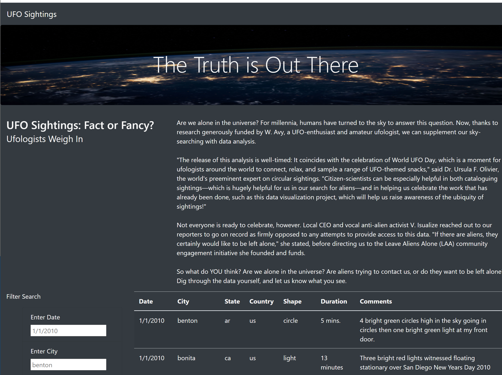
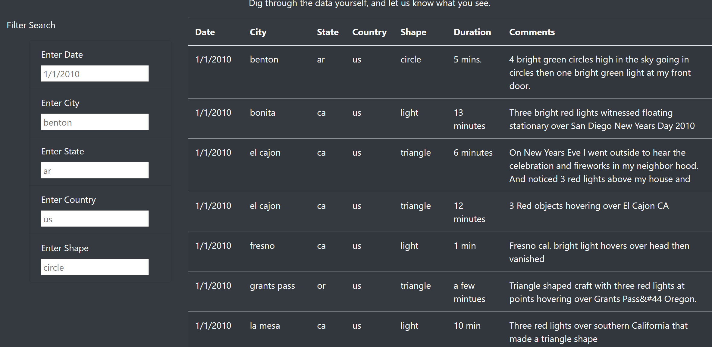
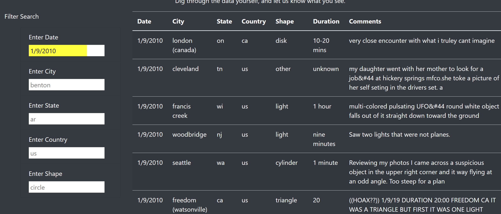
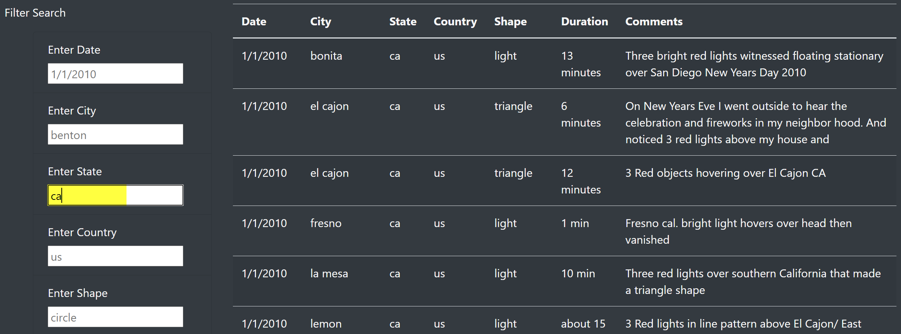
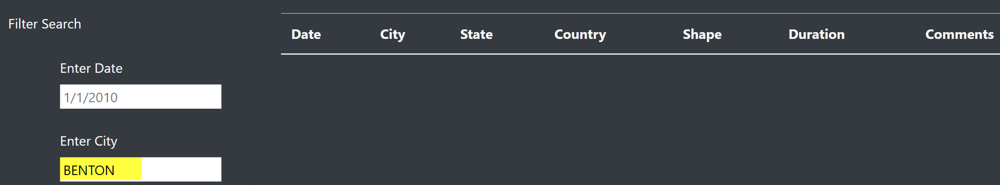

# UFO

# Module 11 Challenge - UFO Sightings

# Overview of Project

The purpose of this project is to create a HTML Webpage to display a table of UFO
sighting data and provide the user with filters to select data rows that match 
the filter criteria.

Using the UFO dataset provided in form of an array of JavaScript objects, it's 
necessary to write code to initially display the table data but also to repopulate
based on changes to Filter Search criteria for City, State, Country and Shape.

Tools used include JavaScript, HTML, CSS and D3.js.

# Results

1. The initial Web page is displayed (index.html).

    - Scroll through towards the bottom of the page to see the Filter Search options. 
    - The search criteria is prefilled with default values for Date, City, State, Country and Shape. 

2. Filter Search
    
    - If the user enters a different date such as 1/9/2010, hits enter, the table is updated.
      Backspace will reload the default value(s) for all filters.

      The same occurs with City, State, Country and Shape. 

      The values for City, State and Country need to be keyed in lowercase because the data is 
      stored in the dataset as lowercase. Typing an uppercase value will not return any results
      and display an empty table. Entering any value that doesn't exist in the dataset
      will also display an empty table.

# Summary

- One Drawback of this Webpage

  The Filter Search parameters are limited to single threading. For example, search for 'light' Shape
  and the results show all however you cannot search 'light' and 'formation' in combination.

- Two Additional Recommendations for Further Development
 
   Enhance the search criteria to ignore word case.
   Add additional functionality to search criteria for dropdown options for all selections including
   comments and duration.

